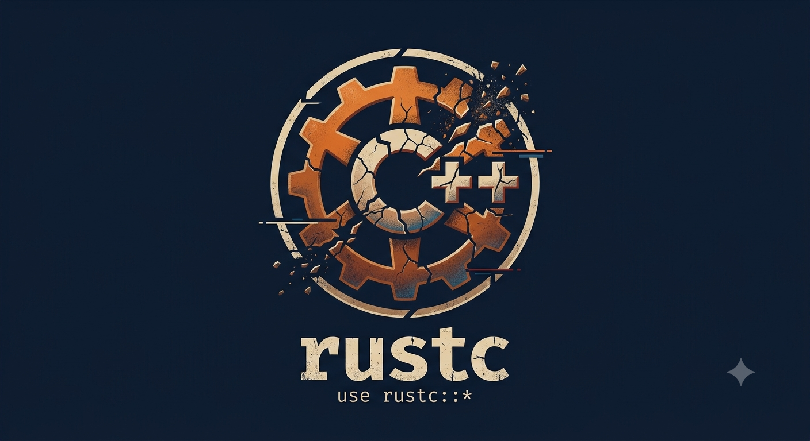

# rustc

rustc —— 让你用 Rust 的语法，体验 C++ 的崩溃。编译全部通过，运行时看缘分。

> 这不是「内存安全」。这是「长得像内存安全的 Rust」。
>
> 公开 API 与标准库**同名同貌**：`String`、`Vec`、`Box`、`Rc`、`spawn`、`vec!`。
> `use rustc::*` 之后，你的代码跟官方文档抄出来的一模一样——编译零错误零警告，
> 公开 API 零 `unsafe`，运行不 panic。唯一的问题：它其实是 C++，只是穿了件 Rust 的外套。
>
> 当你第一次感叹「Rust 不过如此」的时候：
> - 你的 `String::clone()` 已经准备好在作用域结束那刻**双释**给你看；
> - 你的 `for x in &v` 迭代器正在和 `v.push` 抢同一块内存；
> - 你的 `Rc` 在 8 个线程里数引用计数，数出了 3342；
> - 你 `spawn` 出去的闭包，正在读一个已经下班的局部变量；
> - 你 hold 住的 `&'static str`，背后其实是一个已经 free 的坑。
>
> 全是用 `unsafe` 实现的**真实未定义行为**——不是模拟，是真的。
> 没有 panic，只有崩；没有报错，只有 `free(): double free detected` 教你重新做人。
>
> **千万不要在生产环境使用。** 更不要在生产环境旁边使用。
